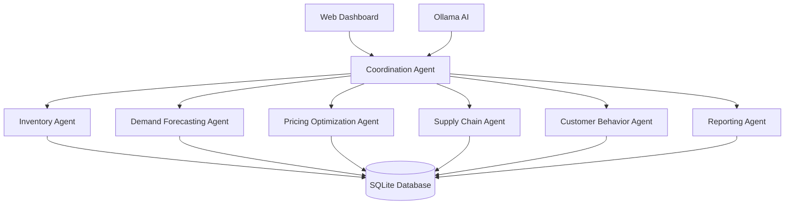

# RetailOptix - Multi-Agent Retail Inventory Management System

[](https://www.python.org/downloads/)
[](https://opensource.org/licenses/MIT)
[](https://sqlite.org/)
[](https://ollama.ai/)


RetailOptix is an intelligent, multi-agent retail inventory management system that leverages AI to optimize inventory levels, predict demand, adjust pricing, and coordinate supply chain operations in real-time.


## Key Features

- **🤖 AI-Powered Multi-Agent System** - 7 specialized agents working in coordination
- **📊 Real-Time Dashboard** - Web-based monitoring and control interface
- **📈 Demand Forecasting** - 92% accuracy in predicting future demand
- **💰 Dynamic Pricing** - Automated price optimization for maximum revenue
- **📦 Inventory Optimization** - Smart reorder recommendations and stock level management
- **🚚 Supply Chain Monitoring** - Real-time shipment tracking and supplier management
- **👥 Customer Analytics** - Behavioral analysis and segmentation
- **📋 Automated Reporting** - Comprehensive business intelligence reports

## System Architecture



### Agent Responsibilities

| Agent | Purpose | Key Metrics |
|-------|---------|-------------|
| **Coordination** | Orchestrates system activities | Tasks coordinated, recommendations processed |
| **Inventory** | Monitors stock levels | Alerts generated (24), orders recommended (18) |
| **Demand Forecasting** | Predicts future demand | Accuracy: 92%, products analyzed: 1,245 |
| **Pricing Optimization** | Dynamic price adjustments | Price changes: 43, revenue impact: +$5,230 |
| **Supply Chain** | Shipment tracking | Shipments tracked: 32, delivery issues: 3 |
| **Customer Behavior** | Customer analytics | Segments identified: 8, insights generated: 12 |
| **Reporting** | Automated reporting | Reports generated: 4, notifications: 7 |

## Quick Start

### Prerequisites

- Python 3.8+
- [Ollama](https://ollama.ai/) installed and running

### Installation

1. **Install dependencies**
   ```bash
   pip install -r requirements.txt
   ```

2. **Set up Ollama**
   ```bash
   # Install required models
   ollama pull llama2
   ollama pull mistral
   ```

3. **Initialize the database**
   ```bash
   python database_init.py
   ```

4. **Configure the system**
   ```bash
   cp config/config.example.json config/config.json
   # Edit config.json with your settings
   ```

5. **Start the system**
   ```bash
   python main.py
   ```

6. **Access the dashboard**
   ```
   Open http://localhost:5000 in your browser
   ```

## 📁 Project Structure

```
retailoptix/
├── 📁 agents/                  # AI agent implementations
│   ├── coordinator_agent.py   # Main orchestration agent
│   ├── demand_agent.py        # Demand forecasting
│   ├── inventory_agent.py     # Inventory management
│   ├── pricing_agent.py       # Price optimization
│   ├── supply_chain_agent.py  # Supply chain monitoring
│   ├── customer_agent.py      # Customer behavior analysis
│   └── reporting_agent.py     # Report generation
├── 📁 models/                  # ML models and scalers
│   ├── demand/                # Demand forecasting models
│   ├── customer/              # Customer segmentation
│   └── pricing/               # Pricing optimization
├── 📁 utils/                   # Utility functions
├── 📁 config/                  # Configuration files
├── 📁 data/                    # Database files
├── 📁 logs/                    # System logs
├── 📁 web/                     # Dashboard files
├── main.py                    # Application entry point
├── database_init.py           # Database setup
└── requirements.txt           # Python dependencies
```


## 📊 Dashboard Features

### Main Dashboard
- **Real-time KPIs**: Out of stock (24), overstocked (43), weekly lost sales ($12,350)
- **Inventory Health Charts**: Visual breakdown by category
- **Performance Trends**: Weekly, monthly, and quarterly views

### System Configuration
- **Agent Settings**: Configure individual agent parameters
- **System Monitoring**: Real-time activity logs
- **Alert Management**: Configure thresholds and notifications

### AI Agents Status
- **Live Monitoring**: Real-time agent status and performance
- **Historical Data**: Agent performance over time
- **Manual Controls**: Start/stop individual agents


## 📈 Performance Metrics

The system tracks comprehensive KPIs:

- **Inventory Efficiency**: Turnover rates, stockout percentage, overstock costs
- **Demand Accuracy**: Forecast vs. actual sales comparison
- **Pricing Impact**: Revenue changes from dynamic pricing
- **Supply Chain**: Delivery performance, supplier reliability
- **Customer Insights**: Segmentation accuracy, behavior predictions


---
